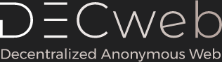

# DECweb


 A New Decentralized Anonymous Internet

DECweb is a thing idk - add description

To run the node:
 - npm install -g truffle
 - npm install -g ganache-cli
 - npm install --save-dev lite-server

To connect to a remote node:
 - Create metamask custom RPC with node IP
 - Get the main account private key and add that account to metamask
 - Open the /src folder and type ```python -m http.server```
 - Navigate to localhost:8000 with your browser of choice